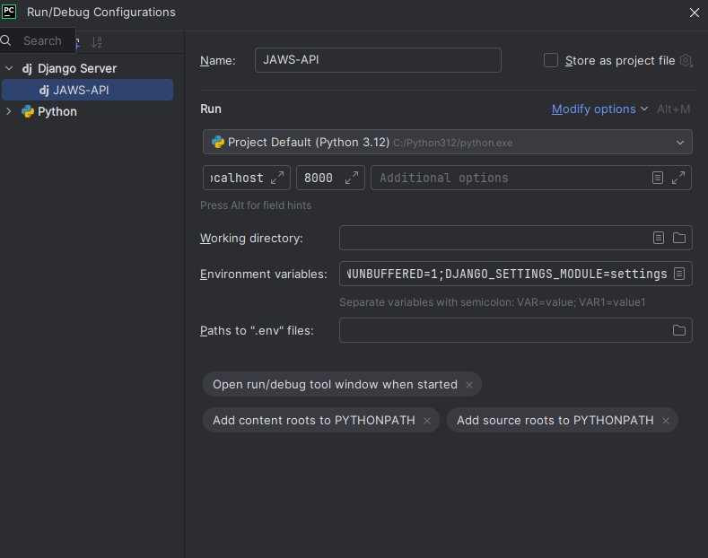
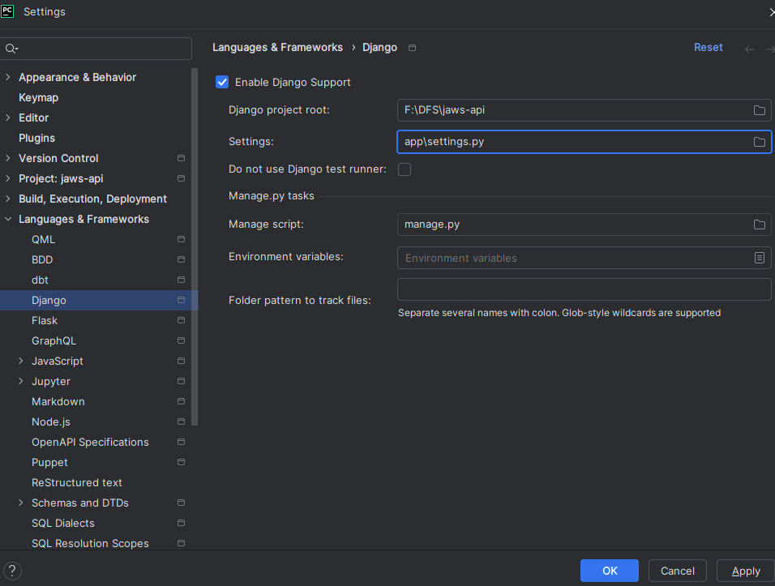

# Setting Up PostgreSQL and Django Models

This guide explains how to create a PostgreSQL database, configure it for use in Django, and migrate models to the database.

---

## **Step 1: Create a PostgreSQL Database**

### **Prerequisites**
- PostgreSQL must be installed and running on your system.
- Access to the PostgreSQL command-line tool (`psql`).

### **Commands to Create the Database**
1. Open a terminal and log in to `psql` with a superuser account:
   ```bash
   psql -U postgres
   
   CREATE DATABASE "USER"; 
   

### **Step 2: Configure Django to Use the Database**
Open your Django project's settings.py file.

Update the DATABASES configuration to include the details of the PostgreSQL database:
    
    DATABASES = {
        'default': {
            'ENGINE': 'django.db.backends.postgresql',
            'NAME': 'USER',//your postgre database
            'USER': 'postgre',your postgre user
            'PASSWORD': 'root',your postgre password
            'HOST': 'localhost',
            'PORT': '5432',
        }
    }

Add this configuration to a .env file like this:
   
   DATABASE_HOST=localhost
   DATABASE_PORT=5432
   DATABASE_PASSWORD=root
   DATABASE_USERNAME=postgres
   DATABASE_NAME=USER
   DATABASE_ENGINE=django.db.backends.postgresql


### **Step 3: Migrate Django Models to PostgreSQL**
**1. Generate Migration Files**
Run the following command to generate migration files for the models in your application:

    python manage.py makemigrations


**2. Apply the Migrations**
Execute the migrations to create the necessary tables in the database:

    python manage.py migrate

Django will now map the models in your project to the PostgreSQL database and create the corresponding tables.

### **PyCharm IDE configuration**




