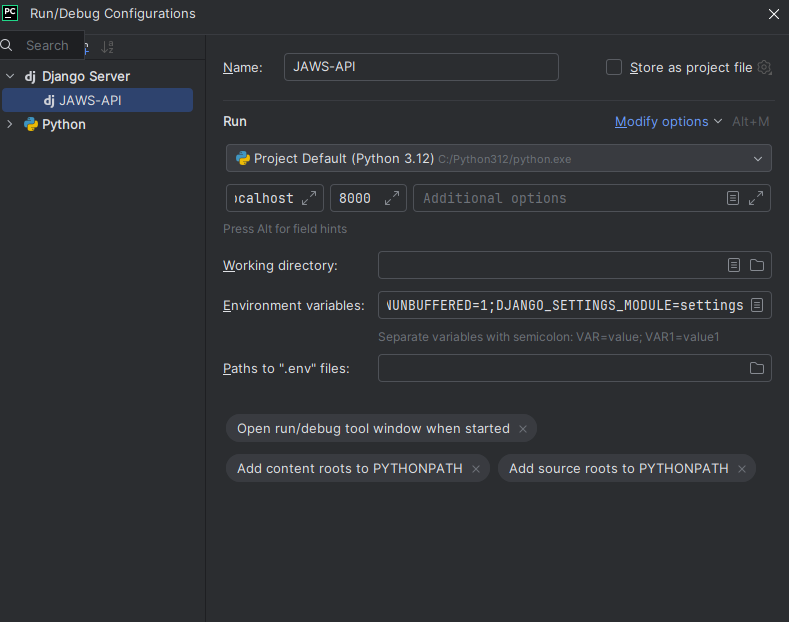
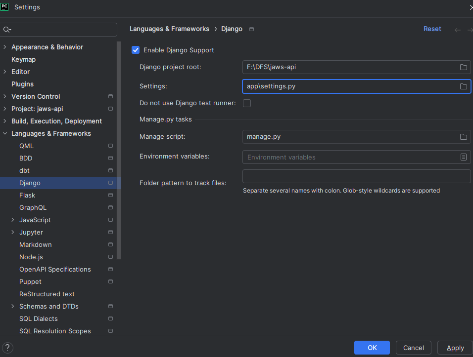

# Setting Up PostgreSQL and Django Models

This guide explains how to create a PostgreSQL database, configure it for use in Django, and migrate models to the database.

---

## **Step 1: Create a PostgreSQL Database**

### **Prerequisites**
- PostgreSQL must be installed and running on your system.
- Access to the PostgreSQL command-line tool (`psql`).
- Create a virtual environment using `python3 -m venv myenv>`

### **Commands to Create the Database**
1. Open a terminal and log in to `psql` with a superuser account:
   ```bash
   psql -U postgres
   
   CREATE DATABASE "USER"; 
   

### **Step 2: Configure Django to Use the Database**
Open your Django project's settings.py file.

Add this configuration to a .env file like this:
   
   DATABASE_HOST=localhost
   DATABASE_PORT=5432
   DATABASE_PASSWORD=root
   DATABASE_USERNAME=postgres
   DATABASE_NAME=USER
   DATABASE_ENGINE=django.db.backends.postgresql

For docker set at 
   DATABASE_HOST=host.docker.internal 


### **Step 3: Migrate Django Models to PostgreSQL**
**1. Generate Migration Files and Apply the Migrations**:
FOLLOW THE ORDER,
Run the following command to generate migration files for the models in your application.
After each generation execute the migrations to create the necessary tables in the database:

    python manage.py migrate

Django will now map the models in your project to the PostgreSQL database and create the corresponding tables.

### **PyCharm IDE configuration**





## Run with docker compose
In order to set up de development environment using docker compose run the following commands
**1. Create the services**
    `docker compose -f docker-compose-dev.yml up --build -d`
    It will create 2 services. A postgres database and the API. After
**2. Run the migrations inside the api container**
    `docker exec jaws-api python3 manage.py migrate`
    With that command python will create all the database schema up-to-date

## Libraries

### 1. **boto3**
   - Python library for interacting with AWS services like S3, EC2, and DynamoDB. Enables programmatic cloud resource management.

### 2. **botocore**
   - Low-level library used by `boto3`, containing configurations and request handling functionalities for AWS services.

### 3. **charset-normalizer**
   - Tool for detecting and handling text encoding. Serves as a lightweight alternative to `chardet` and is compatible with Python 3.

### 4. **Django**
   - High-level, open-source web framework for Python that encourages rapid development and clean, pragmatic design. Ideal for building robust, scalable web applications.

### 5. **django-health-check**
   - Extension for Django that facilitates creating endpoints to monitor the health of services like the database, cache, and storage.

### 6. **djangorestframework**
   - Known as DRF, a powerful and flexible toolkit for building RESTful APIs using Django.

### 7. **psycopg2**
   - Popular PostgreSQL adapter for Python, used for connecting and executing queries on PostgreSQL databases.

### 8. **python-dotenv**
   - Library that loads environment variables from a `.env` file, useful for managing sensitive configurations like API keys.

### 9. **pandas**
   - Essential library for data manipulation and analysis. Provides data structures like DataFrames and Series.

### 10. **requests**
   - Simple and elegant library for making HTTP requests in Python. Supports methods like GET, POST, PUT, DELETE, among others.

### 11. **djangorestframework-simplejwt**
   - Extension for DRF that adds support for authentication based on JSON Web Tokens (JWT), providing a secure way to handle user sessions.

### 12. **django-axes**
   - Tool for managing failed authentication attempts in Django applications, allowing blocking users or IPs after multiple failures.

### 13. **psycopg2-binary**
   - Prepackaged version of `psycopg2` that includes precompiled binaries for easier installation and deployment.

### 14. **django-cors-headers**
   - Middleware to handle CORS (Cross-Origin Resource Sharing) policies in Django applications, necessary to allow APIs to be consumed across different domains.

### 15. **debugpy**
   - Tool for remote debugging in Python. Compatible with IDEs like Visual Studio Code for analyzing code during runtime.

### 16. **pylint**
   - Static code analyzer that checks Python code quality, detecting errors and promoting best practices.

### 17. **social-auth-app-django**
   - Extension for Django that facilitates integration with authentication through social networks like Google, Facebook, and GitHub.

### 18. **coverage**
   - Tool that measures test coverage of Python code, showing which parts of the code are executed during tests and which are not.
   
### 19. **moto**
   - A library that allows you to easily mock out tests based on AWS infrastructure